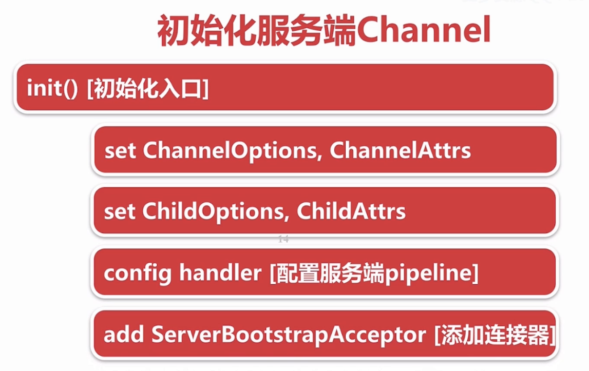

# 簡介
- NioServerSocketChannel

<!--more-->
# 內容

## NioServerSocketChannel create and start
- io.netty.bootstrap.AbstractBootstrap#doBind()
  - final ChannelFuture regFuture = initAndRegister();
    - channel = channelFactory.newChannel();
      - pipeline
    - init(channel)
      - options0
      - attrs0()
      - currentChildOptions
      - currentChildAttrs
      - pipeline.addLast(new ServerBootstrapAcceptor(ch, currentChildGroup, currentChildHandler, currentChildOptions, currentChildAttrs));
    - registor
      - eventloop
      - registor0
        - doRegister
        - invokeHandlerAddedIfNeeded
        - fireChannelRegistered
    - AbstractUnsafe.doBind
      - doBind
        - javaChannel.bind
      - pipeline.fireChannelActived

## ServerBootstrap.bind

---

## NioEventLoop

- ThreadPerTaskExecutor（每次執行都會建立新的線程）
  - DefaultThreadFactory
- FastThreadLocalThread（NioEventLoop的線程，內含有一個InternalThreadLocalMap）
  - InternalThreadLocalMap
    - InternalThreadLocalMap

## NioEventLoop啟動

### 服務器啟動觸發

### accept(0 -> OP_ACCEPT)觸發
- 

### 註冊新連接(與accept(OP_ACCEPT->OP_CONNECT)共用邏輯)

- NioEventLoop#processSelectedKey

### 新连接NioEventLoop
- 創建NioSocketChannel(pipline unsafe)
- 綁定selector(attch=NioSocketChannel)	
- 註冊OP_READ

## pipeline
- 有多個ChannelHanderContext
- head
- tail
### ChannelHanderContext
- 有一個channel
- 有一個hander
- 有一個EventExecutor(NioEventLoop)
- 有多個EvemtFire

# 參考資料

