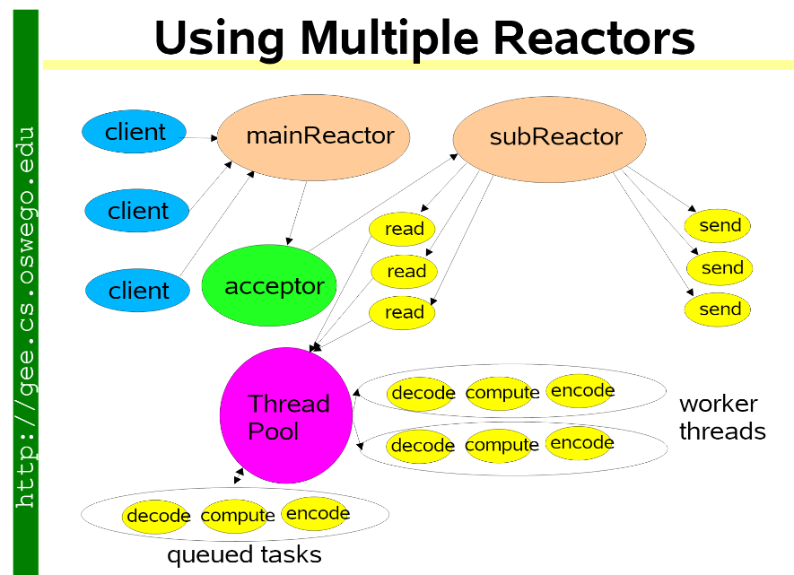
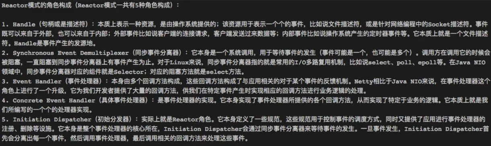
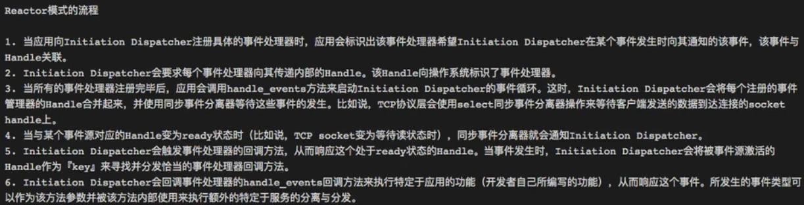

# 簡介

Reactor模式

<!--more-->
# 內容

[NIO](https://github.com/yudady/netty_lecture/blob/master/nio.pdf)

[reactor-siemens](https://github.com/yudady/netty_lecture/blob/master/reactor-siemens.pdf)

# 參考資料
- [精通并发与Netty课程源码-版权所有@北京圣思园](https://github.com/yudady/netty_lecture)
- [Reactor模式详解](https://www.jianshu.com/p/1ccbc6a348db)
- [Reactor与Proactor](https://www.jianshu.com/p/5fe6c59e5c00)

