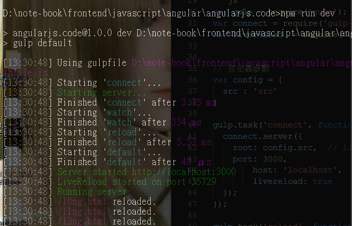
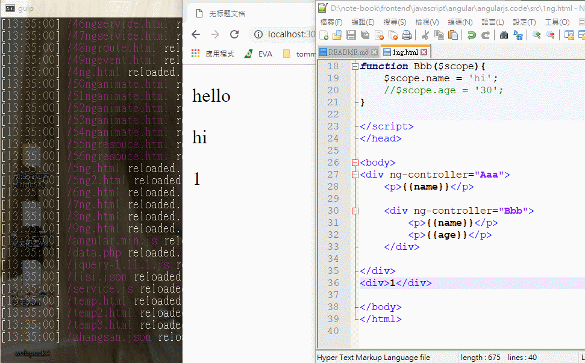

# 簡介

livereload

<!--more-->
# 內容

```js
npm install gulp --save-dev
npm install gulp-connect --save-dev
npm install gulp-livereload --save-dev
```

> 啟動 `npm run dev`



[go](http://localhost:3000/1ng.html)





## gulpfile.js
```js
var gulp = require('gulp');               // 載入 gulp
var connect = require('gulp-connect');		// 載入 http-server
var livereload  = require('gulp-livereload');  // 載入 gulp-livereload


// 自定義參數
var config = {
	src : 'src'
}

gulp.task('connect', function() {
  connect.server({
		root: config.src,  // livereload  根目錄
		port: 3000,
        host: 'localhost',
        livereload: true
  });
});

gulp.task('reload', function () {
	gulp.src([config.src + '/*.*'])	// 需要reload的目錄
		.pipe(livereload());
});

gulp.task('watch', function () {
	livereload.listen({
		start: true,
		basePath: config.src
	});
	
	// 監控
	gulp.watch([config.src + '/*.html'], ['reload']);
	gulp.watch([config.src + '/*.js'], ['reload']);
	
});

gulp.task('default', ['connect', 'watch' ,'reload']);

```


## package.json

```json
{
  "name": "angularjs.code",
  "version": "1.0.0",
  "description": "",
  "main": "index.js",
  "scripts": {
    "test": "echo \"Error: no test specified\" && exit 1",
    "dev": "gulp default"
  },
  "keywords": [],
  "author": "",
  "license": "ISC",
  "devDependencies": {
    "gulp": "^3.9.1",
    "gulp-connect": "^5.7.0",
    "gulp-livereload": "^3.8.1"
  }
}

```

# 參考資料


