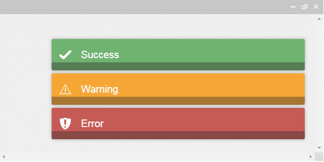

# 簡介

[toastr](https://codeseven.github.io/toastr/demo.html)

<!--more-->
# 內容

## [toastr](https://github.com/CodeSeven/toastr)



```
<script>
  	toastr.options = {
  		// 參數設定[註1]
  		"closeButton": false, // 顯示關閉按鈕
  		"debug": false, // 除錯
  		"newestOnTop": false,  // 最新一筆顯示在最上面
  		"progressBar": true, // 顯示隱藏時間進度條
  		"positionClass": "toast-bottom-left", // 位置的類別
  		"preventDuplicates": false, // 隱藏重覆訊息
  		"onclick": null, // 當點選提示訊息時，則執行此函式
  		"showDuration": "300", // 顯示時間(單位: 毫秒)
  		"hideDuration": "1000", // 隱藏時間(單位: 毫秒)
  		"timeOut": "5000", // 當超過此設定時間時，則隱藏提示訊息(單位: 毫秒)
  		"extendedTimeOut": "1000", // 當使用者觸碰到提示訊息時，離開後超過此設定時間則隱藏提示訊息(單位: 毫秒)
  		"showEasing": "swing", // 顯示動畫時間曲線
  		"hideEasing": "linear", // 隱藏動畫時間曲線
  		"showMethod": "fadeIn", // 顯示動畫效果
  		"hideMethod": "fadeOut" // 隱藏動畫效果
  	}
  	toastr.success( "Success" );
  	toastr.warning( "Warning" );
  	toastr.error( "Error" );
  </script>
```

# 參考資料


