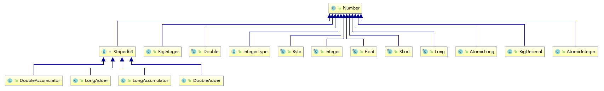

# 簡介

> public abstract class Number implements java.io.Serializable
  - Striped64(Striped64是在java8中添加用来支持累加器的并发组件，它可以在并发环境下使用来做某种计数)
> java.lang.Runtime

<!--more-->
# 內容




## Striped64(lock-free and Still Remain thread-safe.)
- LongAdder-LongAccumulator
- DoubleAdder-DoubleAccumulator


> The call {@code new LongAdder()} is equivalent to {@code new LongAccumulator((x, y) -> x + y, 0L)}
> The call {@code new DoubleAdder()} is equivalent to {@code new DoubleAccumulator((x, y) -> x + y, 0.0)}


## LongAdder
```java
LongAdder counter = new LongAdder();
ExecutorService executorService = Executors.newFixedThreadPool(8);
 
int numberOfThreads = 4;
int numberOfIncrements = 100;
 
Runnable incrementAction = () -> IntStream
  .range(0, numberOfIncrements)
  .forEach(i -> counter.increment());
 
for (int i = 0; i < numberOfThreads; i++) {
    executorService.execute(incrementAction);
}
```

## LongAccumulator
```java
LongAccumulator accumulator = new LongAccumulator(Long::sum, 0L);
int numberOfThreads = 4;
int numberOfIncrements = 100;
 
Runnable accumulateAction = () -> IntStream
  .rangeClosed(0, numberOfIncrements)
  .forEach(accumulator::accumulate);
 
for (int i = 0; i < numberOfThreads; i++) {
    executorService.execute(accumulateAction);
}


```


## Runtime

```java
public static void main(String[] args) {
	try {
		Runtime runtime = Runtime.getRuntime();
		System.out.println(runtime.freeMemory());
		System.out.println(runtime.maxMemory());
		System.out.println(runtime.totalMemory());
		System.out.println(runtime.maxMemory());
		System.out.println(runtime.availableProcessors());

		Thread thread1 = new Thread(() -> {
			System.out.println("Runtime.addShutdownHook 1");
			// runtime.halt(1);
			// 强行终止当前正在运行的Java虚拟机
			// addShutdownHook不會起作用
		});
		Thread thread2 = new Thread(() -> {
			System.out.println("Runtime.addShutdownHook 2");
		});
		Thread thread3 = new Thread(() -> {
			System.out.println("Runtime.addShutdownHook 3");
		});

		// 可以添加多個addShutdownHook
		runtime.addShutdownHook(thread3);
		runtime.addShutdownHook(thread2);
		runtime.addShutdownHook(thread1);

		TimeUnit.SECONDS.sleep(1);

		runtime.removeShutdownHook(thread2);

		System.out.println("main.end");
	} catch (Exception e) {
		e.printStackTrace();
	}

}
```

# 參考資料


