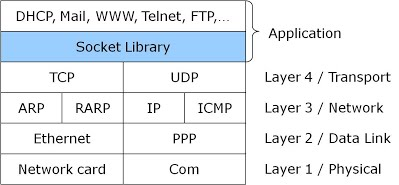
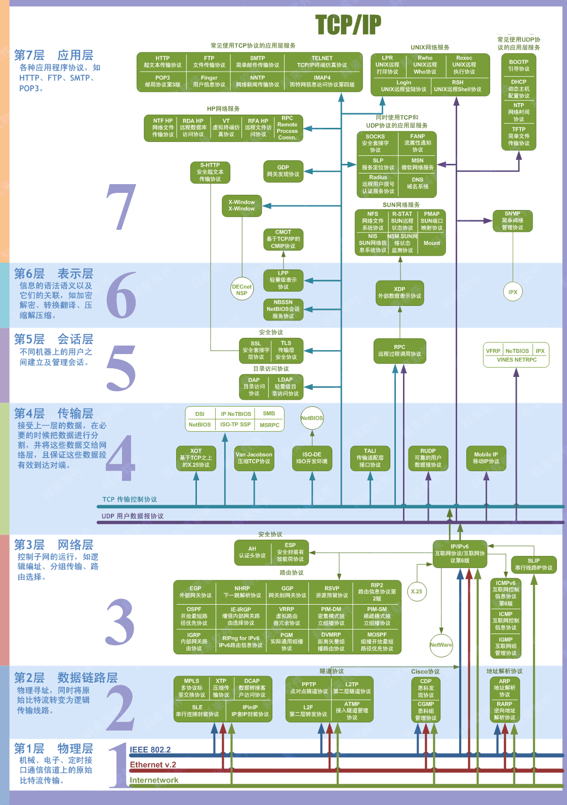
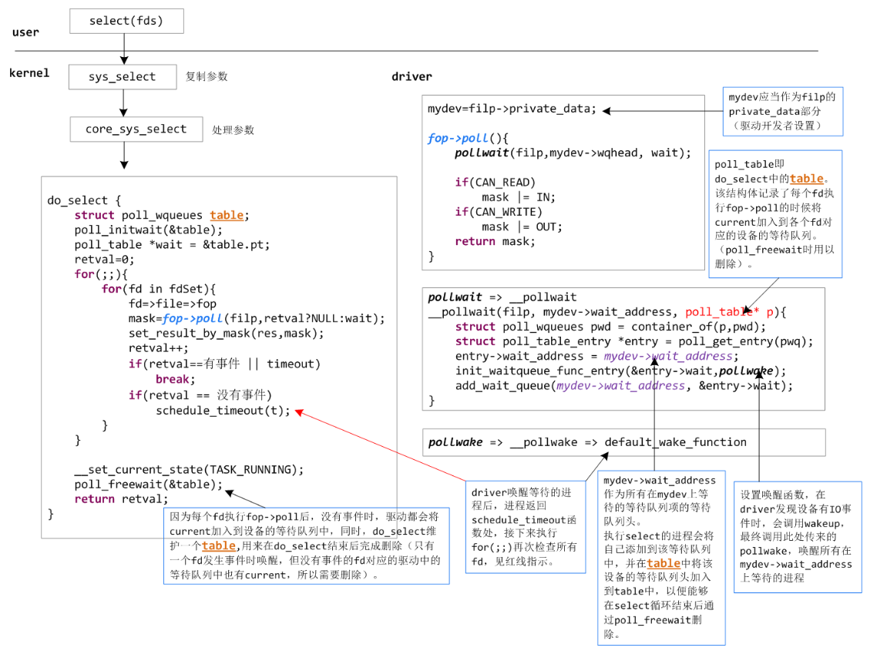
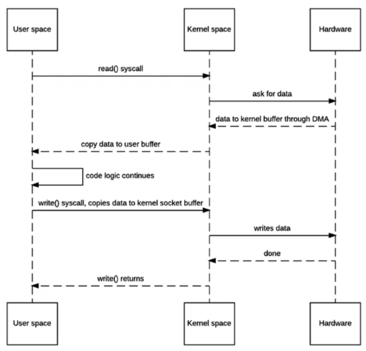
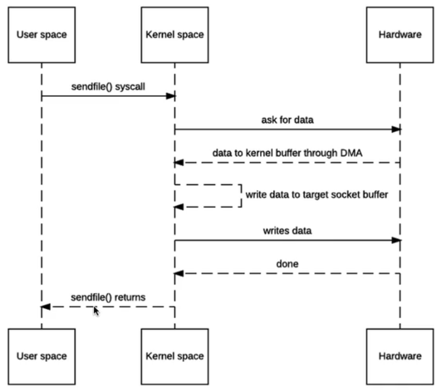
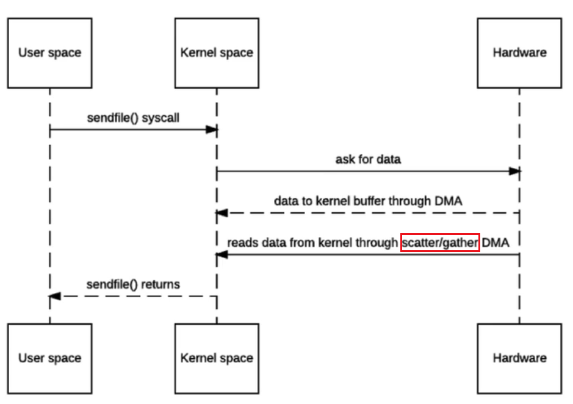
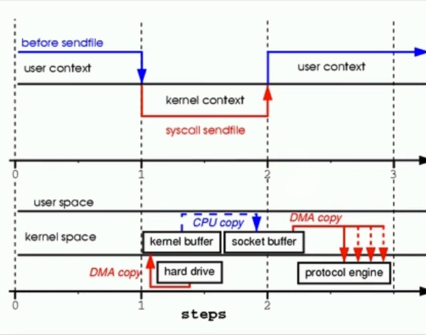

# 簡介

Socket Library是BSD UNIX的一個API (Application Programming Interface)。

> 使用目的：網路應用程式設計者不需處理網路下層(傳輸層、網路層)的工作，而專注於其本身(應用層)的程式設計。

<!--more-->
# 內容

## 应用程序协议中消息的成帧与解析
- 基于定界符：消息的结束由一个唯一的标记指出，即发送者在传输完数据后显式添加的一个特定字节序列，这个特殊标记不能在传输的数据中出现（这也不是绝对的，应用填充技术能够对消息中出现的定界符进行修改，从而使接收者不将其识别为定界符）。该方法通常用在以文本方式编码的消息中。
- 显式长度：在变长字段或消息前附加一个固定大小的字段，用来指示该字段或消息中包含了多少字节。该方法主要用在以二进制字节方式编码的消息中。

## select模型
[select](https://www.cnblogs.com/apprentice89/archive/2013/05/09/3069561.html)

## epoll模型
[epoll](https://www.cnblogs.com/apprentice89/archive/2013/05/06/3063039.html)

## 零拷貝（read file than send to network）

# 參考資料
[國立中山大學程式諮詢網](https://sites.google.com/a/mis.nsysu.edu.tw/cheng-shi-zi-xun-wang/java-jin-jie-pian/wang-lu-pian/1-shen-me-shisocket)
[TCP/UDP、IP 、Socket、HTTP笔记](https://www.jianshu.com/p/8b605de1e491)
[聊聊Socket、TCP/IP、HTTP、FTP及网络编程](https://www.jianshu.com/p/8565912949bb)
[Socket、长短连接、IO分类](https://www.jianshu.com/p/29c05a102d4f)
[Java TCP/IP Socket 编程](http://wiki.jikexueyuan.com/project/java-socket/)

