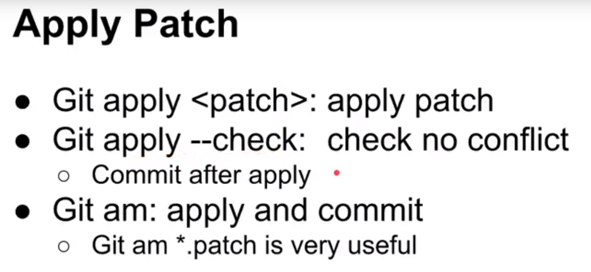
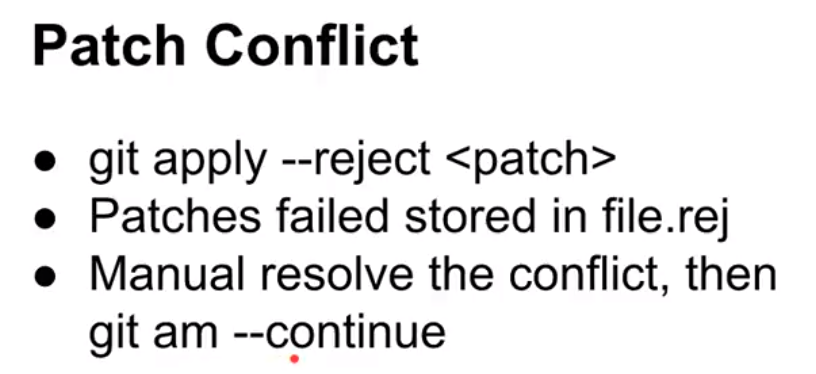
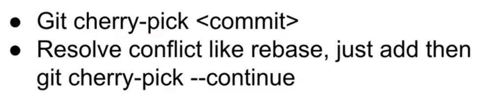

# 簡介

> 打補丁

> 後悔藥（git reset HEAD^ --hard）

<!--more-->
# 內容

## git patch

### 两个commit间的修改（包含两个commit）
> git format-patch d77aaac74845435744c49ae65511d9e1be79ed5c...046ee8f8423302f5070ca81b4e246516e919cd7a -o patch

### 单个commit
> git format-patch -1 <r1>

### n个commit (from head cal  n  commit)
> git format-patch -n <r1>

### 从某commit以来的修改（不包含该commit）
> git format-patch <r1>

## 把生成的patch文件拷贝到目标git目录下

### 检查patch文件
> git apply --stat 0001-minor-fix.patch

### 查看是否能应用成功
> git apply --check 0001-minor-fix.patch

### 应用patch
> git am -s < 0001-minor-fix.patch

## 衝突

# cherry-pick

# 參考資料

- [Git 教學系列 - Patch and Cherry-Pick](https://www.youtube.com/watch?v=juPuEiwRvvE)

