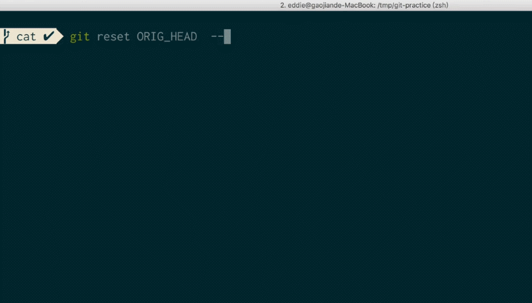

# 簡介

rebase發生錯誤，需要復原`git reset ORIG_HEAD --hard`
> 發生錯誤原因，在master分支上面使用`git rebase dev`（錯誤的操作）

[演示錯誤](https://www.youtube.com/watch?v=fLvr4BRoJ8I)

<!--more-->
# 內容

1. git checkout issue(開始開發) .... （開發完畢）
2. git checkout `master`
3. git pull (master最新了)
4. git checkout issue (準備開始合併) 
5. git rebase master（把master當作基礎，開始衍合）
6. 遇到衝突後需要（git rebase --continue），衝突解決後
7. git add .
8. git commit -m "[issue]"
9. git checkout master
10. git merge issue (目前在master分支上面)
11. git branch -d issue （刪除 issue 分支）
12. 如果要改寫歷史記錄 `git commit --amend`
13. git push master

# 如果不用分支開發

[使用git fetch和git rebase處理多人開發同一分支的問題](https://codertw.com/%E7%A8%8B%E5%BC%8F%E8%AA%9E%E8%A8%80/554398/)

## 第一種
- git fetch
- git rebase
- 解決衝突
- git add 衝突檔案
- git rebase –continue
- git push

## 第二種(Pull + Rebase)，方便
- 修改代码
- commit
- git pull --rebase
- git push
### 修改git pull的默认行为
每次都加–rebase似乎有些麻烦，我们可以指定某个分支在执行git pull时默认采用rebase方式：

```sh
git config branch.master.rebase true
git config branch.autosetuprebase always

[branch "master"]
	remote = origin
	merge = refs/heads/master
	rebase = true
[branch]  
  autosetuprebase = always


// 全局生效
git config --global pull.rebase true
git config --global branch.autoSetupRebase always

// clean global
git config --global --unset pull.rebase
git config --global --unset branch.autoSetupRebase
```

`.git/config`


如果你觉得所有的分支都应该用rebase，那就设置：
> git config --global branch.autosetuprebase always


- [使用 git rebase 让历史变得清晰](http://shzhangji.com/cnblogs/2014/12/23/use-git-rebase-to-clarify-history/)
- [git pull 時請愛用 rebase](http://rubyist.marsz.tw/blog/2012-01-20/git-pull-with-rebase/)


# 參考資料
- [使用 rebase 合併分支](https://backlog.com/git-tutorial/tw/stepup/stepup2_8.html)
- [Git 教學系列 - Rebase](https://www.youtube.com/watch?v=0nwqar3ycTY&index=6&list=PLlyOkSAh6TwcvJQ1UtvkSwhZWCaM_S07d)

