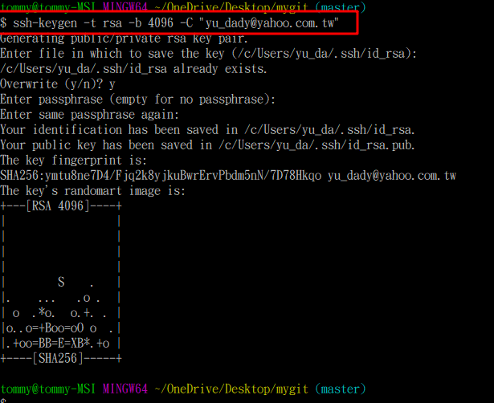
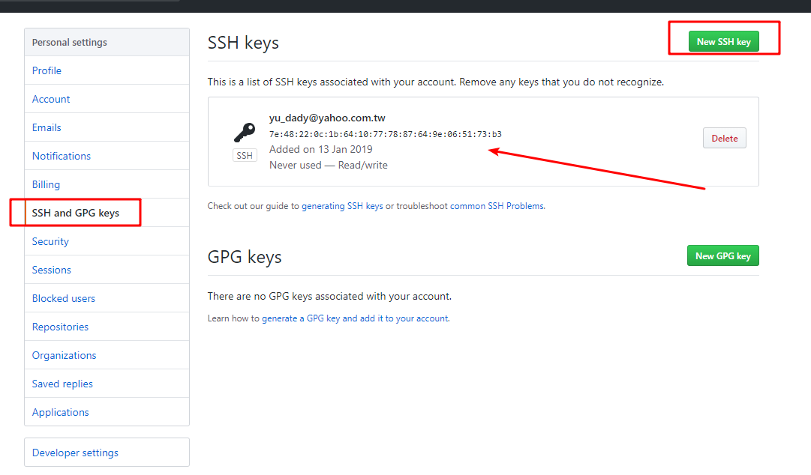

# 簡介

github使用ssh

<!--more-->
# 內容

[github.key教學](https://help.github.com/articles/generating-a-new-ssh-key-and-adding-it-to-the-ssh-agent/)

> ssh-keygen -t rsa -b 4096 -C "your_email@example.com"

# 參考資料

