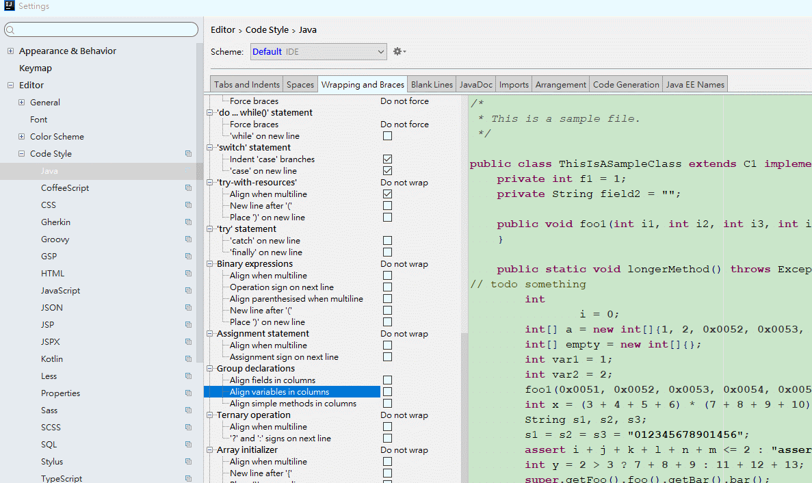

# 簡介

紀錄熱鍵

<!--more-->
# 內容

### Switching Between Open Projects
> Ctrl+Alt+]
> Ctrl+Alt+[

### 自動補全返回值
> ctrl + alt + v

### 在行尾增加分號
> Ctrl + Shift + Enter - 本身的含義是自動完成，如果需要的話，會在行尾添加分號或是大括號；

### 打開繼承樹
> ctrl + alt + U

### 如何找目錄
> ctrl + shift + n 後，使用/

### 自動翻譯選中文字
> ctrl + shift + Y

### 尋找頁面方法
> ctrl + F12

---

###　代碼提示不區分大小寫
> 將Case sensitive completion 設置為None就可以了

### 開啟自動 import 包的功能

### 去掉導航欄
> 使用alt+v，然後去掉Navigation bar即可

## intellij code setting

# 參考資料
- [IntelliJ IDEA 2017 快捷键大全](https://www.jianshu.com/p/74b12008a726)
- [快捷键](https://github.com/judasn/IntelliJ-IDEA-Tutorial/blob/master/keymap-introduce.md)
- [IntelliJ IDEA 使用教程](http://wiki.jikexueyuan.com/project/intellij-idea-tutorial/)

