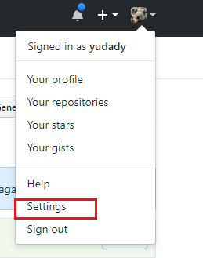
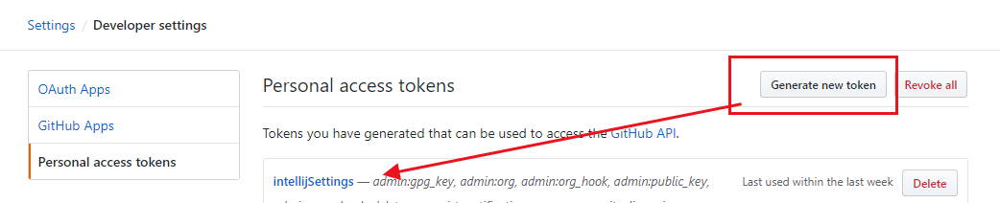

# 設定 Intellij


## 消除intellij `import *`


## Intellij codeStyle


## Intellij Java Properties File Transfer
> 編碼自動轉換


## 把Intellij設定檔同步到Github，可以在其他地方匯入


- 看到一個同步的聯結網址
- github創建一個目錄，貼上去
- 要求取得"Personal access tokens"






- https://github.com/yudady/intellijSettings.git
- 開始同步數據，你懂得！ 


# 變更設定目錄
> idea.properties

```java
#---------------------------------------------------------------------
# Uncomment this option if you want to customize path to IDE config folder. Make sure you're using forward slashes.
#---------------------------------------------------------------------
# idea.config.path=${user.home}/.IntelliJIdea/config
idea.config.path=D:/install/JetBrains/ideaIU-2018.2.2/.IntelliJIdea2018.2/config
#---------------------------------------------------------------------
# Uncomment this option if you want to customize path to IDE system folder. Make sure you're using forward slashes.
#---------------------------------------------------------------------
# idea.system.path=${user.home}/.IntelliJIdea/system
idea.system.path=D:/install/JetBrains/ideaIU-2018.2.2/.IntelliJIdea2018.2/system
#---------------------------------------------------------------------

```

# 參考資料


