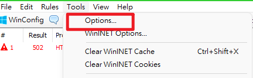
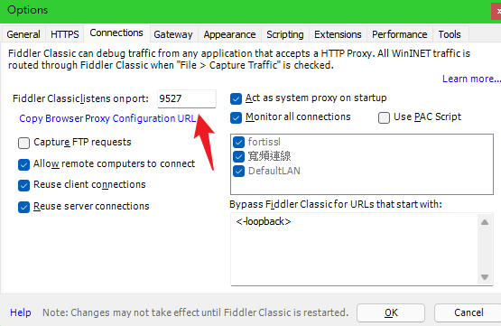
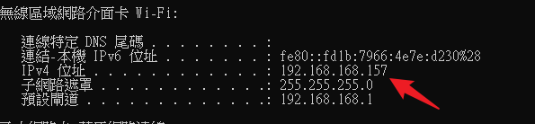
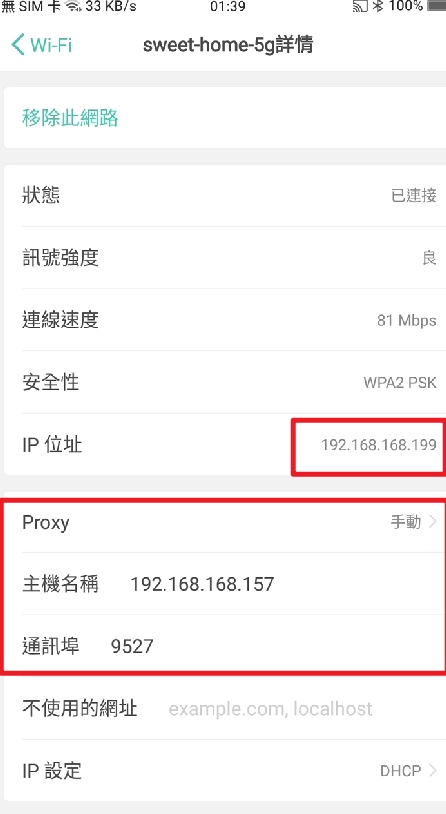
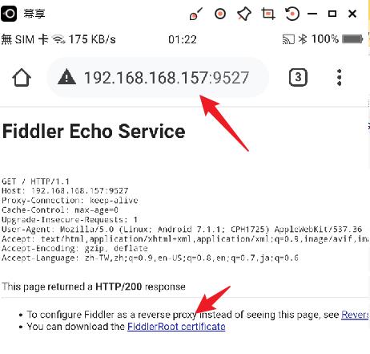
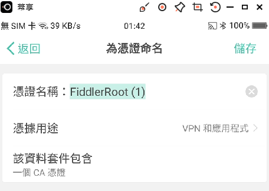
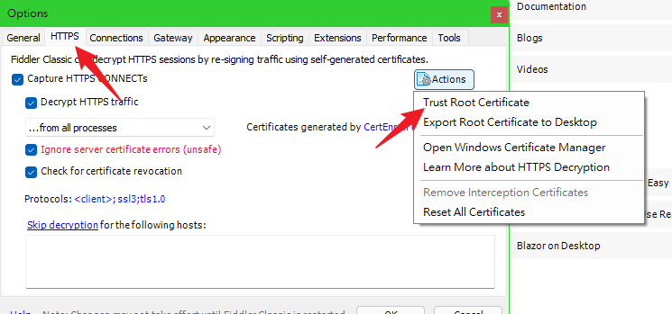
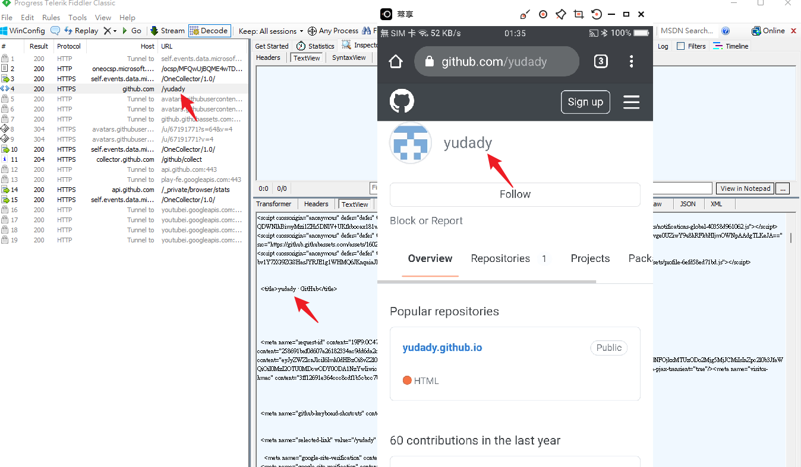

# 抓包工具（Fiddler Classic）
> 抓包

[Fiddler Classic | Original Web Capturing Tool for Windows](https://www.telerik.com/fiddler/fiddler-classic)

### Fiddler設定

### 代理設定

> 手機網路設定

> 安裝CA-ROOT憑證 [CA憑證](../security/CA.md)

> 安裝憑證

### Https 設定

### 參考資料
[玩轉 Fiddler－HTTP(s) 抓包能手 & 常見「特殊」用途：叡揚部落格](https://www.gss.com.tw/blog/%E7%8E%A9%E8%BD%89-fiddler%EF%BC%8Dhttp-s-%E6%8A%93%E5%8C%85%E8%83%BD%E6%89%8B-%E5%B8%B8%E8%A6%8B%E3%80%8C%E7%89%B9%E6%AE%8A%E3%80%8D%E7%94%A8%E9%80%94)

[松勤课堂-fiddler抓取https实战_哔哩哔哩_bilibili](https://www.bilibili.com/video/BV1Av4117749?spm_id_from=333.337.search-card.all.click)

