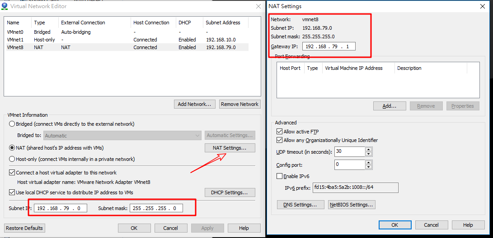
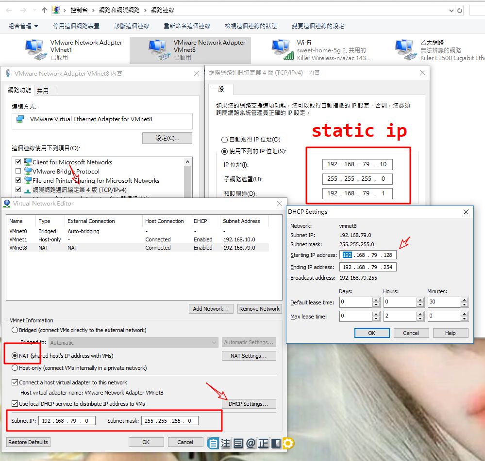
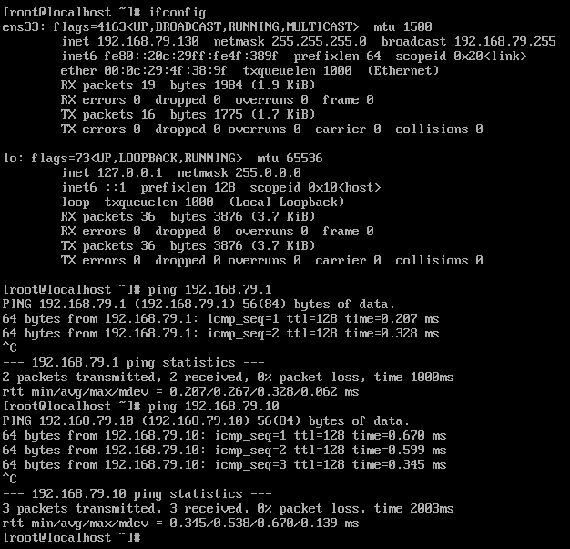
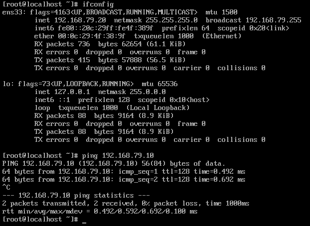

# 簡介

VMware

<!--more-->
# 內容

## vmware 網路NET模式
### windows配置靜態IP地址




### static IP
```s
TYPE=Ethernet
PROXY_METHOD=none
BROWSER_ONLY=no
BOOTPROTO=static
DEFROUTE=yes
IPV4_FAILURE_FATAL=yes
IPV6INIT=no
IPV6_AUTOCONF=no
IPV6_DEFROUTE=no
IPV6_FAILURE_FATAL=no
IPV6_ADDR_GEN_MODE=stable-privacy
NAME=ens33
UUID=deff87b2-8e32-4c73-971e-d38f6b258113
DEVICE=ens33
ONBOOT=yes
IPV6_PRIVACY=no
PREFIX=24
IPADDR=192.168.79.20
GATEWAY=192.168.79.1
NETMASK=255.255.255.0
DNS1=192.168.79.1
```




### DHCP IP
```s
TYPE=Ethernet
PROXY_METHOD=none
BROWSER_ONLY=no
BOOTPROTO=dhcp
DEFROUTE=yes
IPV4_FAILURE_FATAL=yes
IPV6INIT=no
IPV6_AUTOCONF=no
IPV6_DEFROUTE=no
IPV6_FAILURE_FATAL=no
IPV6_ADDR_GEN_MODE=stable-privacy
NAME=ens33
UUID=deff87b2-8e32-4c73-971e-d38f6b258113
DEVICE=ens33
ONBOOT=yes
IPV6_PRIVACY=no
PREFIX=24

```

### windows hosts location
> C:\Windows\System32\drivers\etc
```s
192.168.79.10 w10
192.168.79.20 w20
192.168.79.21 w21
192.168.79.22 w22
192.168.79.23 w23
192.168.79.24 w24
192.168.79.25 w25
192.168.79.26 w26
192.168.79.27 w27
192.168.79.28 w28
192.168.79.29 w29
```

### 設定 hostname
> hostnamectl set-hostname 新的hostname

```s
[root@localhost ~]# hostnamectl set-hostname w20
重新登入
```

### 編輯/etc/hosts
```s
[root@w20 ~]# cat /etc/hosts
127.0.0.1   localhost localhost.localdomain localhost4 localhost4.localdomain4
::1         localhost localhost.localdomain localhost6 localhost6.localdomain6

192.168.79.10 w10
192.168.79.20 w20
192.168.79.21 w21
192.168.79.22 w22
192.168.79.23 w23
192.168.79.24 w24
192.168.79.25 w25
192.168.79.26 w26
192.168.79.27 w27
192.168.79.28 w28
192.168.79.29 w29
[root@w20 ~]# 


```

```s
[root@w20 ~]# ping w10
PING w10 (192.168.79.10) 56(84) bytes of data.
64 bytes from w10 (192.168.79.10): icmp_seq=1 ttl=128 time=0.311 ms
64 bytes from w10 (192.168.79.10): icmp_seq=2 ttl=128 time=0.522 ms
^C
--- w10 ping statistics ---
2 packets transmitted, 2 received, 0% packet loss, time 1000ms
rtt min/avg/max/mdev = 0.311/0.416/0.522/0.107 ms
[root@w20 ~]# 

```


# 參考資料
- [VMware序號](https://ithelp.ithome.com.tw/questions/10186230)
- [Assigning an ESXi 6.5 License](https://www.thomas-krenn.com/en/wiki/Assigning_an_ESXi_6.5_License)

